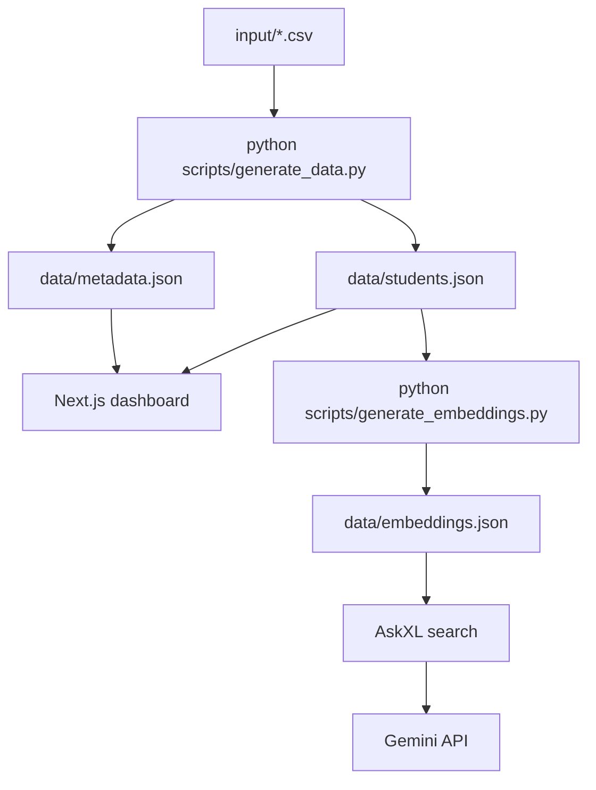

# AskXL

AskXL is a file-based AI student intelligence MVP for XLRI.

## Installation

1. Install Node.js 18+ and Python 3.10+.
2. Install dependencies:

```bash
npm install
```

## Folder Structure

```text
AskXL/
  input/
    *.csv
    sample_projects/
      *.md
    reference/
      *.html
  scripts/
    generate_data.py
    generate_embeddings.py
    utils.py
  data/
    students.json
    metadata.json
    embeddings.json
  app/
  components/
  lib/
  public/
  README.md
  AGENTS.md
```

## Regenerate JSON

Build the canonical student dataset from the CSV sources:

```bash
python3 scripts/generate_data.py
```

This reads every CSV under `input/`, joins the tables on `student_id`, and rewrites:

- `data/students.json`
- `data/metadata.json`

## Regenerate Embeddings

Create the lightweight search index used by the chatbot:

```bash
python3 scripts/generate_embeddings.py
```

This rewrites:

- `data/embeddings.json`

## Run Locally

```bash
npm run dev
```

Open:

```text
http://localhost:3000
```

## Gemini Configuration

Set these environment variables before using the chatbot:

```bash
GEMINI_API_KEY=your_key_here
GEMINI_MODEL=gemini-1.5-flash
```

If `GEMINI_API_KEY` is missing, the app falls back to a deterministic local Markdown response.

## Architecture



## Notes

- The frontend never reads CSV files directly.
- New CSV files or sample project markdown files are discovered automatically.
- Placement data is not present in the source files, so the current dashboard treats project participation as the strongest available proxy and marks placement data as unavailable.
